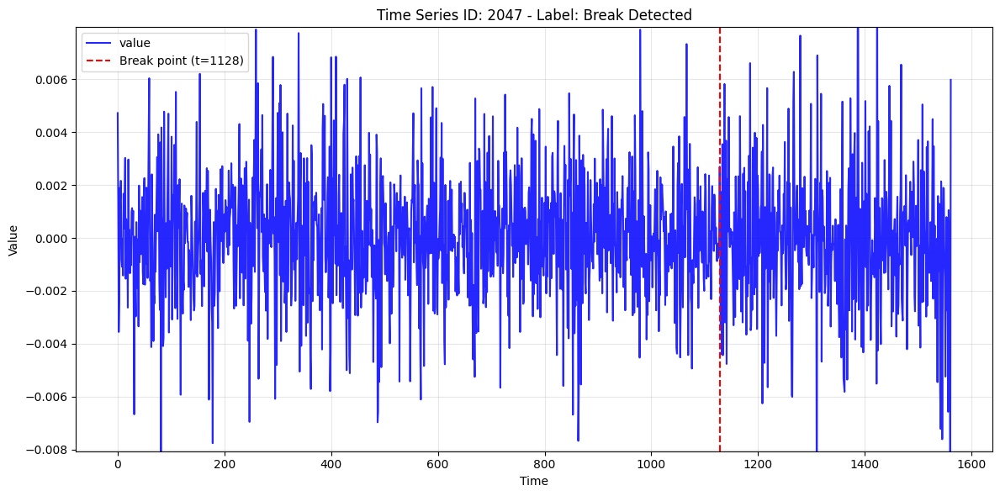

# Structural Break Detection - Stacked Ensemble

## Context
This repository contains my solution code for the **CrunchDAO - Structural Break** competition.  
👉 Competition page: https://hub.crunchdao.com/competitions/structural-break

## Task & Data
Binary classification on univariate time series. For each time series ID we observe a univariate series `value[t]` split into two segments by a `period` flag (e.g., `0 = before`, `1 = after`). The label is `y[id] ∈ {0,1}`, where `1` means the after segment exhibits a structural break relative to before. A structural break is defined as a change in the underlying data-generating process. The goal is to maximize ROC-AUC on hidden IDs.

## My Approach In 5 Bullets

- **Preprocessing (per ID & period):** Robust standardization using BEFORE-segment median/MAD, winsorization based on BEFORE-segment thresholds, and per-segment detrending and mean-centering; outputs a long table with parallel series (e.g., `standardized`, `clipped`, `detrended`, diffs, abs, squared), one column per series needed downstream.
- **Feature blocks:** 200+ features including quantile ratios, threshold-crossing rates, autocorrelation deltas, statistical tests, distances, and FFT/bandpower metrics over standardized `z`, first differences `Δz`, second differences `Δ²z`, absolute values `|z|`, squared values `z²`. Also include boundary/local features around the before→after breakpoint and rolling-window statistics. Each block is cached to Parquet and merged by `id`.
- **Feature Selection:** Prune collinear features by dropping one from each pair with |ρ| > 0.98 (I did that manually that's why it's not in the code), then retain all features whose univariate ROC-AUC exceeds a set threshold.
- **Base Learners:** Train multiple base learners (e.g., XGB/LGB/Cat) with nested CV. Outer CV to produce OOF predictions on held-out IDs, lightweight inner CV via Optuna to select hyperparameters. Repeat across seeds then take the average top seeds for predictions.
- **Meta-Learner/Stacking:** Build meta-features from base OOFs (per-model logits + `logit_mean`/`logit_std`), train a small XGBoost meta-learner across seeds, average top seeds for final predictions.

## Repo Layout

~~~text
ADIA-STRUCTURAL-BREAK/
├─ data/                                      
│  ├─ ids_holdout.csv                          # X_train IDs reserved as a holdout; append to X_test.index to create a larger local test set for evaluation
│  ├─ prediction.parquet                       # latest run’s per-ID predicted probabilities on X_test.reduced
│  ├─ X_test.reduced.parquet                  
│  ├─ X_train.part1.parquet                    # X_train is split in 3 because GitHub only allows files < 100 MB
│  ├─ X_train.part2.parquet
│  ├─ X_train.part3.parquet
│  ├─ y_test.reduced.parquet                  
│  └─ y_train.parquet                         
├─ docs/
│  └─ break_example.png                        # example series with a structural break (referenced in README)
│  └─ preprocess_columns.md                    # column spec for preprocess_*.parquet (definitions + which feature blocks use which series)
├─ notebooks/
│  ├─ exploratory_data_analysis.ipynb
│  └─ final_submission.ipynb                        
├─ resources/                                  # all cached artifacts
│  ├─ features/                                
│  │  ├─ preprocessed_*.parquet                # preprocessed time series; input to feature blocks (columns documented in docs/preprocess_columns.md)
│  │  ├─ all_*.parquet                         # join of all feature blocks; input to base learners
│  │  ├─ moments_*.parquet                     # moments
│  │  ├─ quantiles_*.parquet                   # robust quantile stats
│  │  ├─ rates_*.parquet                       # change/rate features
│  │  ├─ autocorr_*.parquet                    # ACF/PACF-style summaries
│  │  ├─ tests_distances_*.parquet             # statistical tests & distances
│  │  ├─ frequency_*.parquet                   # FFT/bandpower features
│  │  ├─ differences_*.parquet                 # diffs/abs-diffs/curvature
│  │  ├─ absolute_*.parquet                    # |z| features
│  │  ├─ squared_*.parquet                     # z² features
│  │  ├─ boundary_local_*.parquet              # local boundary stats
│  │  ├─ boundary_edge_*.parquet               # edge/before-after deltas
│  │  ├─ curvature_*.parquet                   # 2nd-diff summaries
│  │  ├─ rolling_*.parquet                     # rolling windows
│  │  └─ ar_*.parquet                          # AR model coefficients
│  └─ model/
│     ├─ base/             
│     │  ├─ xgb_main/
│     │  │  ├─ seed_169/
│     │  │  │  ├─ fold_models/                 
│     │  │  │  │  ├─ fold_0.joblib             # serialized sklearn pipeline
│     │  │  │  │  ├─ fold_0_hp.json            # hyperparameters selected via inner-CV/Optuna
│     │  │  │  │  ... (one per outer fold)
│     │  │  │  ├─ cvmeta.joblib                # cache signature (inputs/knobs)
│     │  │  │  ├─ full_data_refit.joblib       # full-data refit (optional)
│     │  │  │  ├─ metrics.json                 # per-fold AUCs + pooled OOF AUC + full-data AUC
│     │  │  │  └─ oof.npy                      # OOF predictions
│     │  │  ├─ seed_186/
│     │  │  ├─ seed_203/
│     │  │  ├─ avg_top2_oof.npy                # averaged OOF of top-K seeds
│     │  │  └─ avg_top2.txt                    # list of top-K seeds + ensemble AUC
│     │  ├─ cat_main/                             
│     │  ├─ lgb_main/              
│     │  └─ xgb_lite/                      
│     └─ meta/         
│        └─ xgb/
│           ├─ seed_2069/
│           │  ├─ meta.json                    # cache signature (inputs/knobs)
│           │  ├─ metrics.json                 # per-fold AUCs + pooled OOF AUC + full-data AUC
│           │  ├─ model.json                   # XGBoost booster
│           │  └─ oof.npy                      # OOF predictions
│           ├─ seed_2086/
│           ├─ seed_2103/
│           ├─ avg_top2_oof.npy
│           └─ avg_top2.txt
│     └─ meta_artifact.joblib                  # selected meta seeds + model paths for inference
├─ src/
│  ├─ config.py                                # global knobs (CV, seeds, paths, thresholds)
│  ├─ preprocess.py                            # heavy preprocessing (standardize/winsorize/detrend)
│  ├─ feature_extraction.py                    # computes each feature block
│  ├─ train.py                                 # base-learner
│  ├─ stacking.py                              # meta-learner
│  ├─ infer.py                                 # fold-ensemble → seed-average → meta
│  └─ utils.py                                 # small helpers
├─ .gitignore                                  
├─ main.ipynb                                  
├─ readme.md                                   
└─ requirements.txt                          
~~~